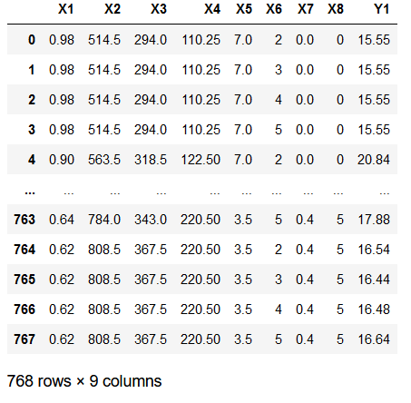
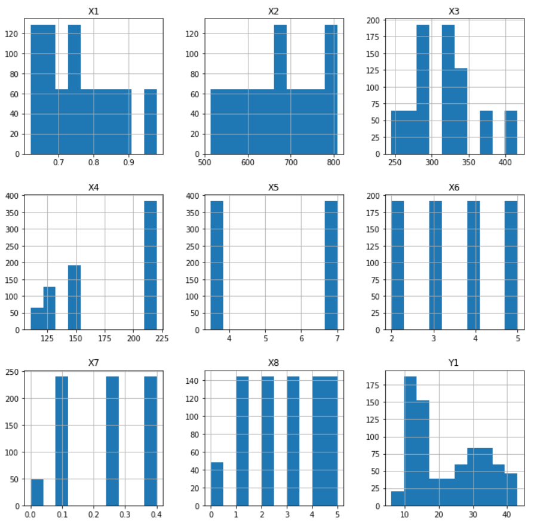
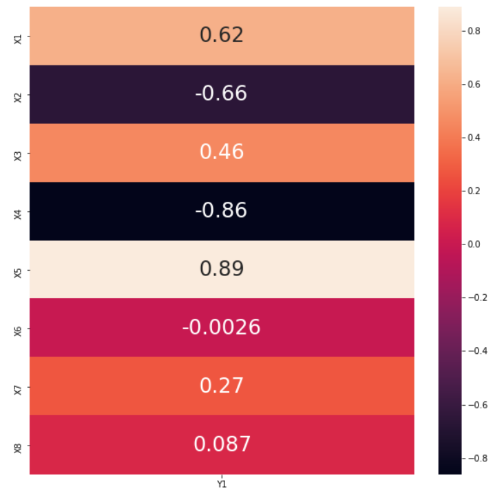
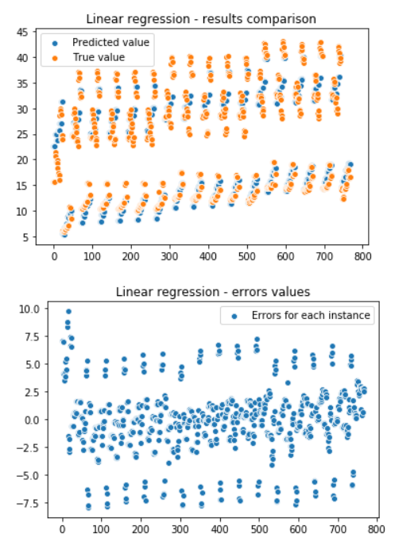
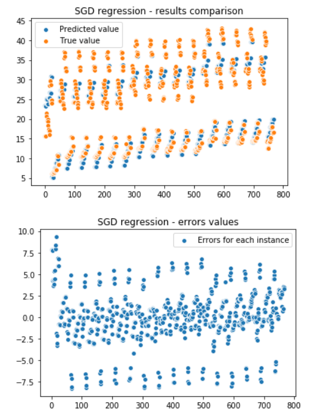
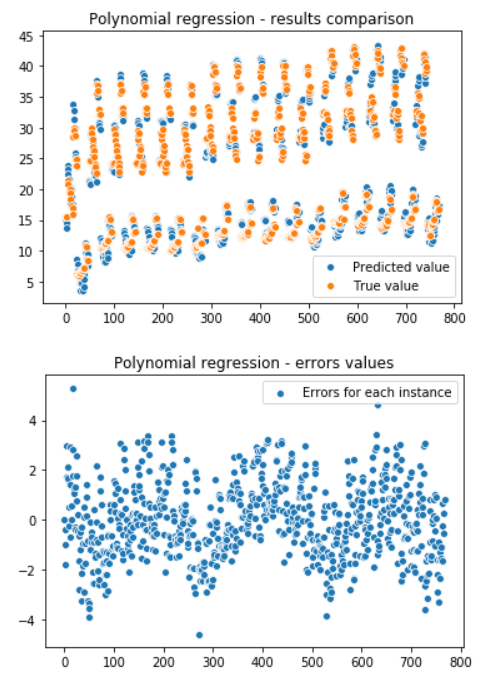

# Energy-efficiency-regression
Energy-efficiency-regression

This study looked into assessing the heating load and cooling load requirements of buildings (that is, energy efficiency) as a function of building parameters.  
https://archive.ics.uci.edu/ml/datasets/Energy+efficiency#  
Data source: A. Tsanas, A. Xifara: 'Accurate quantitative estimation of energy performance of residential buildings using statistical machine learning tools', Energy and Buildings, Vol. 49, pp. 560-567, 2012 (the paper can be accessed from [http://people.maths.ox.ac.uk/tsanas/publications.html]) 

## First look on data
### Dataframe

### Histograms

### Correlations: features vs labels

### Linear regression
 coefficient:  
Test set  
0.9121810593690274  
Coefficients:  
-6.20562948e+01 -1.32681318e+11  1.32681318e+11  2.65362636e+11  
 4.12368477e+00 -3.23452728e-02  2.01431378e+01  2.11123455e-01  
Intercept:  
79.9987825732899  

### SGD regression
 coefficient:  
Test set:  
0.908526785449197  
Coefficients:  
-2.72917019 -1.24154149  1.51610576 -2.0032117   7.6683292  -0.03578116
 2.69169779  0.32611915  
Intercept:  
22.15533009  

#### Polynomial regression (degree=2)
 coefficient:  
Test set:  
**0.975827051479881**  
Coefficients:  
-1.10113436e+09 -1.19641816e+07  7.24116522e+04 -8.97213854e+04
 -2.25073423e+05 -1.84519791e+05  1.09980758e+00  6.82257308e+01
  4.69295803e+00 -1.71358915e+05  2.55261952e+05 -2.55607558e+05
 -4.68884839e+05  8.91455425e+05  2.42272464e+00  1.11556288e+01
  1.94348609e+00  9.48167217e+07 -8.97195317e+07 -1.64369417e+08
 -4.24786869e+05  2.22804458e+04 -2.38933340e+04 -1.65002641e+05
 -5.09719010e+06 -3.54583463e+07  4.26060802e+05 -2.22804415e+04
  2.38933976e+04  1.65002638e+05 -5.05278971e+07  8.46972710e+05
 -4.45609037e+04  4.77863871e+04  3.30005270e+05 -1.21893779e+04
 -4.84865506e-01 -5.62033873e+00 -2.61855300e-01 -8.62950522e-02
  2.97883144e+00  8.89664385e-02 -1.84885043e+01 -6.57174763e-01
 -3.75386451e-01
Intercept:  
1113906294.7019076  

